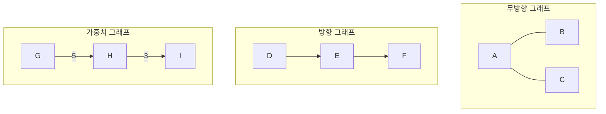

> 자료구조 스터디에서 그래프 파트를 공부하며 배운 점을 정리해 보았습니다.

<br>

**- 알아볼 내용 -**
1. [그래프 기본 개념과 용어](#그래프-기본-개념과-용어)
2. [그래프를 코드로 표현하는 법](#그래프의-표현-방법)
3. [그래프 탐색: DFS와 BFS](#그래프-탐색-dfs--bfs)
4. [최단 경로 알고리즘](#최단-경로-알고리즘)
   - [다익스트라 (Dijkstra)](#1-다익스트라-알고리즘-dijkstras-algorithm)
   - [벨만-포드 (Bellman-Ford)](#2-벨만-포드-알고리즘-bellman-ford-algorithm)
   - [플로이드-워셜 (Floyd-Warshall)](#3-플로이드-워셜-알고리즘-floyd-warshall-algorithm)

---

## 그래프 기본 개념과 용어

**그래프(Graph)**는 **정점(Vertex)**과 그 정점을 연결하는 **간선(Edge)**으로 이루어진 자료구조입니다. 정점들의 관계를 표현할 때 유용해서, SNS 친구 관계나 도시 간의 도로망 등을 모델링하는 데 자주 사용됩니다.

- **트리와의 차이점**: 트리는 사이클이 없는 특별한 그래프이지만, 일반적인 그래프는 사이클을 가질 수 있고, 부모-자식 같은 계층 구조가 없습니다.

- **주요 용어**
  - **정점(Vertex/Node)**: 데이터가 저장되는 기본 단위.
  - **간선(Edge/Link)**: 정점 간의 연결선.
  - **무방향 그래프(Undirected Graph)**: 간선에 방향이 없어 양방향으로 이동 가능.
  - **방향 그래프(Directed Graph)**: 간선에 방향이 있어 한쪽으로만 이동 가능.
  - **가중치 그래프(Weighted Graph)**: 간선에 비용이나 거리 같은 가중치가 부여된 그래프. **네트워크**라고도 합니다.
  - **차수(Degree)**: 정점에 연결된 간선의 수. (방향 그래프에서는 In-degree/Out-degree로 구분)



## 그래프의 표현 방법

그래프를 코드로 표현할 때는 주로 두 가지 방법을 씁니다.

#### 1. 인접 행렬 (Adjacency Matrix)
`V x V` 크기의 2차원 배열에 정점 간의 연결 정보를 저장합니다. `matrix[i][j]`에 가중치를 넣는 식입니다.
- **장점**: 두 정점의 연결 여부를 **O(1)** 만에 확인할 수 있어 빠릅니다.
- **단점**: 간선이 적어도 항상 **O(V²)**의 공간이 필요해서, 정점이 많은 희소 그래프(sparse graph)에서는 메모리 낭비가 큽니다.

#### 2. 인접 리스트 (Adjacency List)
각 정점에 연결된 이웃 정점들을 연결 리스트로 저장합니다.
- **장점**: 실제 간선 수만큼의 공간(**O(V+E)**)만 차지해 효율적입니다. 현대의 복잡한 그래프는 대부분 희소 그래프이므로 이 방법이 훨씬 널리 쓰입니다.
- **단점**: 두 정점의 연결 여부를 알려면 리스트를 돌아봐야 해서 시간이 좀 더 걸립니다.

## 그래프 탐색 (DFS & BFS)

그래프의 모든 정점을 방문하는 방법으로, DFS와 BFS가 가장 기본적입니다.

- **깊이 우선 탐색 (DFS, Depth-First Search)**: 한 길을 끝까지 파고들었다가, 막히면 이전 갈림길로 돌아와 다른 길을 탐색하는 방식입니다. **재귀 함수**나 **스택**으로 구현합니다.
- **너비 우선 탐색 (BFS, Breadth-First Search)**: 시작점에서 가까운 정점부터 차례로 방문하는 방식입니다. **큐**를 사용해 구현하며, 가중치가 없는 그래프에서 최단 경로를 찾는 데 쓰입니다.

#### C언어 전체 탐색 예제
아래는 인접 리스트로 그래프를 만들고 DFS, BFS를 수행하는 실행 가능한 예제입니다.

```c
#include <stdio.h>
#include <stdlib.h>

// --- 그래프 및 큐 기본 설정 ---
#define MAX_VERTICES 50

typedef struct GraphNode {
    int vertex;
    struct GraphNode* link;
} GraphNode;

GraphNode* adj_list[MAX_VERTICES];
int visited[MAX_VERTICES];
int g_num_vertices;

int queue[MAX_VERTICES];
int front = -1, rear = -1;

// --- 그래프 및 큐 함수 ---
void init_graph(int n) {
    g_num_vertices = n;
    for (int i = 0; i < n; i++) adj_list[i] = NULL;
}

void insert_edge(int u, int v) {
    GraphNode* node = (GraphNode*)malloc(sizeof(GraphNode));
    node->vertex = v;
    node->link = adj_list[u];
    adj_list[u] = node;
}

void reset_visited() {
    for (int i = 0; i < g_num_vertices; i++) visited[i] = 0;
}

void enqueue(int value) { if(rear < MAX_VERTICES - 1) queue[++rear] = value; }
int dequeue() { return (front == rear) ? -1 : queue[++front]; }
int is_queue_empty() { return front == rear; }


// --- DFS & BFS 구현 ---
void dfs(int v) {
    visited[v] = 1;
    printf("%d ", v);
    for (GraphNode* w = adj_list[v]; w; w = w->link) {
        if (!visited[w->vertex]) dfs(w->vertex);
    }
}

void bfs(int start) {
    reset_visited();
    visited[start] = 1;
    printf("%d ", start);
    enqueue(start);

    while (!is_queue_empty()) {
        int v = dequeue();
        for (GraphNode* w = adj_list[v]; w; w = w->link) {
            if (!visited[w->vertex]) {
                visited[w->vertex] = 1;
                printf("%d ", w->vertex);
                enqueue(w->vertex);
            }
        }
    }
}

// --- 메인 함수 ---
int main(void) {
    init_graph(4);
    insert_edge(0, 1); insert_edge(0, 2);
    insert_edge(1, 2);
    insert_edge(2, 0); insert_edge(2, 3);
    insert_edge(3, 3);

    printf("DFS 탐색 (시작: 2): ");
    reset_visited();
    dfs(2);
    printf("\n");

    printf("BFS 탐색 (시작: 2): ");
    bfs(2);
    printf("\n");

    return 0;
}
```

---

## 최단 경로 알고리즘
가중치 그래프에서 두 정점 사이의 경로 중 가중치의 합이 가장 작은 경로를 찾는 문제입니다.

### 1. 다익스트라 알고리즘 (Dijkstra's Algorithm)

하나의 시작 정점에서 다른 모든 정점까지의 최단 경로를 찾는 알고리즘입니다. **단, 간선에 음의 가중치가 없어야 합니다.**

**핵심 원리:**
탐욕법(Greedy)에 기반하여, '현재까지 알려진 가장 짧은 경로'를 하나씩 확정해 나갑니다.

1.  모든 정점까지의 거리를 '무한대'로, 시작 정점만 0으로 초기화합니다.
2.  아직 방문하지 않은 정점 중, 거리가 가장 짧은 정점을 선택합니다.
3.  선택한 정점을 거쳐가는 것이 인접 정점들의 기존 경로보다 짧으면, 거리를 갱신합니다.
4.  모든 정점을 방문할 때까지 2~3번을 반복합니다.

**효율적인 구현:**
2번 과정(거리가 가장 짧은 정점 선택)을 매번 순차 탐색하면 O(V²)의 시간이 걸립니다. 이 부분을 **우선순위 큐(Priority Queue)**를 사용해 O(log V)로 줄이면, 전체 시간 복잡도가 **O(E log V)**로 크게 개선되어 효율적입니다.

#### C언어 의사코드 (우선순위 큐 사용)
```c
// 그래프는 인접 리스트로 표현되었다고 가정
void dijkstra(Graph* graph, int src) {
    int V = graph->V;
    int dist[V]; // 시작점으로부터의 거리를 저장할 배열

    // 1. 우선순위 큐(Min-Heap) 생성 및 초기화
    MinHeap* minHeap = createMinHeap(V);
    for (int v = 0; v < V; ++v) {
        dist[v] = INF; // 모든 거리를 무한대로 초기화
        addToMinHeap(minHeap, v, dist[v]);
    }

    // 2. 시작점의 거리는 0으로 설정
    dist[src] = 0;
    decreaseKey(minHeap, src, 0); // 힙에서 시작점의 거리 값 갱신

    // 3. 힙이 빌 때까지 반복
    while (!isMinHeapEmpty(minHeap)) {
        // 3-1. 거리가 가장 짧은 정점(u)을 힙에서 추출
        MinHeapNode* minHeapNode = extractMin(minHeap);
        int u = minHeapNode->v;

        // 3-2. u와 인접한 정점(v)들을 순회하며 거리 갱신
        AdjListNode* adj_node = graph->array[u];
        while (adj_node != NULL) {
            int v = adj_node->dest;
            // u를 거쳐 v로 가는 거리가 기존 v의 거리보다 짧으면 갱신
            if (isInMinHeap(minHeap, v) && dist[u] != INF && adj_node->weight + dist[u] < dist[v]) {
                dist[v] = dist[u] + adj_node->weight;
                decreaseKey(minHeap, v, dist[v]); // 힙에 갱신된 거리 반영
            }
            adj_node = adj_node->next;
        }
    }

    // 결과 출력
    printf("정점\t 시작점으로부터의 거리\n");
    for (int i = 0; i < V; ++i)
        printf("%d \t\t %d\n", i, dist[i]);
}
```
<details>
<summary><b>참고: C언어 최소 힙(Min-Heap) 구현 세부사항</b></summary>
<div markdown="1">
```c
// 다익스트라를 위한 최소 힙 구현은 다음과 같은 구조와 함수들을 포함합니다.
// 실제 코드는 복잡하므로 구조 위주로 이해하는 것이 좋습니다.

// 힙의 노드
typedef struct MinHeapNode { int v; int dist; } MinHeapNode;

// 힙 전체 구조체
typedef struct MinHeap {
    int size;      // 힙에 저장된 노드의 수
    int capacity;  // 힙의 최대 크기
    int *pos;      // 정점이 힙의 어느 인덱스에 있는지 추적
    MinHeapNode **array;
} MinHeap;

// 힙 생성, 노드 교환, 힙 속성 유지(minHeapify), 최소값 추출(extractMin),
// 특정 키 값 감소(decreaseKey), 힙에 원소가 있는지 확인(isInMinHeap) 등의
// 함수가 필요합니다.
```
</div>
</details>

### 2. 벨만-포드 알고리즘 (Bellman-Ford Algorithm)
다익스트라와 비슷하지만, **음수 가중치가 있는 간선도 처리 가능**하며, **음수 사이클**까지 탐지할 수 있습니다.
- **동작 방식**: 모든 간선 `E`개를 `V-1`번 반복해서 확인하며, 각 정점까지의 거리를 점진적으로 갱신합니다. `V`번째 반복에서 또 갱신이 일어난다면 음수 사이클이 존재한다고 판단합니다.
- **시간 복잡도**: **O(VE)**로 다익스트라보다 느리지만 범용성이 높습니다.

#### C 의사코드
```c
void bellmanFord(Graph* graph, int src) {
    int V = graph->V;
    int E = graph->E;
    int dist[V];

    // 1. 거리 배열 초기화
    for (int i = 0; i < V; i++) dist[i] = INF;
    dist[src] = 0;

    // 2. V-1번 동안 모든 간선(u, v)에 대해 거리 갱신 시도
    for (int i = 1; i <= V - 1; i++) {
        for (int j = 0; j < E; j++) {
            // if (dist[u] + weight(u,v) < dist[v]) { dist[v] = ... }
        }
    }

    // 3. V번째 반복에서 갱신이 또 발생하면 음수 사이클 존재
    // ...
}
```

### 3. 플로이드-워셜 알고리즘 (Floyd-Warshall Algorithm)
**모든 정점 쌍 사이의 최단 경로**를 한 번에 구하는 알고리즘입니다. 동적 계획법(DP)을 사용합니다.
- **동작 방식**: 'k'라는 중간 경유지를 거쳐가는 경로가 기존 경로보다 짧으면 갱신하는 것을 모든 정점 `k`에 대해 반복합니다. (`D[i][j] = min(D[i][j], D[i][k] + D[k][j])`)
- **시간 복잡도**: **O(V³)**로, 구현이 매우 간단해 정점 수가 적을 때 유용합니다.

#### C 의사코드
```c
// dist[i][j]는 i에서 j까지의 가중치로 초기화 (연결 없으면 INF)
void floydWarshall(int dist[V][V]) {
    for (int k = 0; k < V; k++) { // k: 거쳐가는 노드
        for (int i = 0; i < V; i++) { // i: 출발 노드
            for (int j = 0; j < V; j++) { // j: 도착 노드
                if (dist[i][k] + dist[k][j] < dist[i][j]) {
                    dist[i][j] = dist[i][k] + dist[k][j];
                }
            }
        }
    }
}
```
