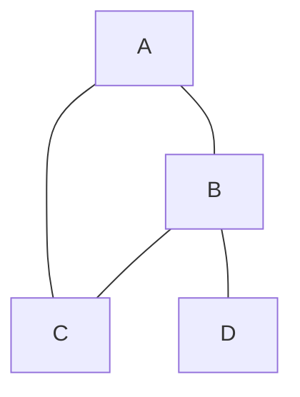
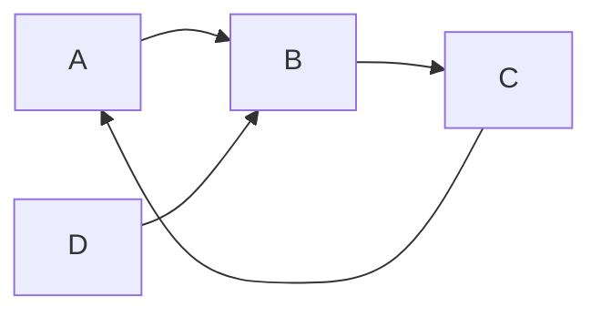
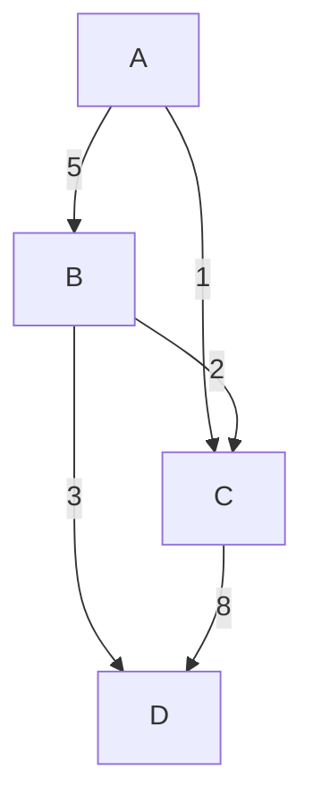

## 그래프란 무엇인가?

그래프(Graph)는 정점(Vertex)과 그 정점을 연결하는 간선(Edge)의 집합으로 구성된 비선형 자료구조입니다. 우리 주변의 많은 복잡한 시스템들이 그래프로 표현될 수 있습니다. 예를 들어, 소셜 네트워크의 사용자 관계, 도시를 연결하는 도로망, 웹페이지의 하이퍼링크 등이 모두 그래프 구조입니다.

트리와 달리 그래프는 부모-자식 관계라는 제약이 없으며, 사이클(Cycle)이 발생할 수도 있습니다. 사실, 트리는 사이클이 없는 연결 그래프의 특별한 한 종류입니다.

## 주요 용어 정리

- **정점 (Vertex 또는 노드 Node)**: 데이터를 표현하는 개체 (e.g., 사람, 도시, 웹페이지)
- **간선 (Edge 또는 링크 Link)**: 정점 간의 관계를 나타내는 선.
- **인접 정점 (Adjacent Vertex)**: 하나의 간선으로 직접 연결된 두 정점.
- **차수 (Degree)**: 한 정점에 연결된 간선의 수.
  - **진입 차수 (In-degree)**: 방향 그래프에서 한 정점으로 들어오는 간선의 수.
  - **진출 차수 (Out-degree)**: 방향 그래프에서 한 정점에서 나가는 간선의 수.
- **경로 (Path)**: 한 정점에서 다른 정점으로 가는 간선의 순차적인 나열.
- **사이클 (Cycle)**: 시작 정점과 끝 정점이 같은 단순 경로.

## 그래프의 종류

### 1. 무방향 그래프 (Undirected Graph)

간선에 방향이 없는 그래프입니다. A와 B가 연결되어 있다면, A에서 B로 갈 수도 있고 B에서 A로 갈 수도 있습니다.



### 2. 방향 그래프 (Directed Graph)

간선에 방향이 있는 그래프입니다. A에서 B로 가는 화살표가 있다면 A에서 B로만 이동할 수 있습니다.



### 3. 가중치 그래프 (Weighted Graph)

간선에 가중치(비용, 거리, 시간 등)가 할당된 그래프입니다. 네트워크(Network)라고도 불립니다. 최단 경로 찾기 문제 등에서 핵심적으로 사용됩니다.



## 그래프의 표현 방법

그래프를 코드로 구현하는 데에는 크게 두 가지 방법이 있습니다.

### 1. 인접 행렬 (Adjacency Matrix)

V x V 크기 (V: 정점의 수)의 2차원 배열을 사용하여 정점 간의 연결 관계를 표현합니다. `matrix[i][j]`가 1(또는 가중치)이면 i와 j 사이에 간선이 있다는 의미입니다.

- **장점**: 두 정점의 연결 여부를 **O(1)** 시간에 바로 확인할 수 있습니다.
- **단점**: 정점의 수에 비해 간선이 적은 '희소 그래프'의 경우, 메모리 낭비가 심합니다. (공간 복잡도: **O(V²)**)

```c
#define MAX_VERTICES 5
// 가중치가 없다면 0과 1로, 있다면 가중치 값으로 채웁니다.
int adj_matrix[MAX_VERTICES][MAX_VERTICES];
```

### 2. 인접 리스트 (Adjacency List)

각 정점마다 해당 정점과 연결된 다른 정점들의 리스트를 저장합니다. 연결 리스트(Linked List)를 주로 사용합니다.

- **장점**: 간선의 수만큼만 메모리를 사용하므로 '희소 그래프'에 효율적입니다. (공간 복잡도: **O(V+E)**, E: 간선의 수)
- **단점**: 두 정점의 연결 여부를 확인하려면 해당 정점의 리스트를 탐색해야 하므로 시간이 더 걸립니다. (최대 **O(V)**)

```c
#include <stdio.h>
#include <stdlib.h>

#define MAX_VERTICES 50

// 인접 리스트의 노드 구조 (가중치 포함 시)
typedef struct GraphNode {
    int vertex;
    int weight; // 가중치 추가
    struct GraphNode* link;
} GraphNode;

GraphNode* adj_list[MAX_VERTICES];
// ... 이하 로직은 가중치를 고려하여 수정 필요
```

## 그래프 탐색

그래프의 모든 정점을 방문하는 방법으로, **깊이 우선 탐색(DFS)**과 **너비 우선 탐색(BFS)**이 대표적입니다.

### 1. 깊이 우선 탐색 (DFS, Depth-First Search)

한 정점에서 시작하여 다음 경로로 넘어가기 전에 해당 경로를 따라갈 수 있을 때까지 깊게 파고드는 방식입니다. 스택(Stack) 또는 재귀 함수로 구현할 수 있습니다.

- **C 코드 (재귀, 인접 리스트 기반)**
```c
int visited[MAX_VERTICES];

void dfs(int v) {
    visited[v] = 1;
    printf("정점 %d -> ", v);

    for (GraphNode* w = adj_list[v]; w; w = w->link) {
        if (!visited[w->vertex]) {
            dfs(w->vertex);
        }
    }
}
```

### 2. 너비 우선 탐색 (BFS, Breadth-First Search)

한 정점에서 시작하여 인접한 모든 정점을 먼저 방문한 후, 그 다음 레벨의 정점들을 차례로 방문하는 방식입니다. 큐(Queue)를 사용하여 구현합니다. 최단 경로(간선의 수가 가장 적은)를 찾는 데 사용될 수 있습니다.

- **C 코드 (큐, 인접 리스트 기반)**
```c
// ... (큐 구현은 이전과 동일) ...

void bfs(int start_vertex) {
    // ... (visited 배열 초기화 및 큐 로직은 이전과 동일) ...
}
```

---

## 최단 경로 알고리즘 (Shortest Path Algorithms)

가중치 그래프에서 한 정점에서 다른 정점까지 가는 데 드는 비용이 가장 적은 경로를 찾는 문제입니다.

### 1. 다익스트라 알고리즘 (Dijkstra's Algorithm)

하나의 시작 정점에서 다른 모든 정점까지의 최단 경로를 찾는 알고리즘입니다. **음의 가중치를 가진 간선이 없을 때**만 정확하게 동작합니다.

**동작 방식:**
1. 출발 노드를 설정하고, 출발 노드 자신은 거리 0, 나머지는 무한(∞)으로 초기화합니다.
2. 아직 방문하지 않은 정점 중 거리가 가장 짧은 정점을 선택합니다.
3. 해당 정점을 거쳐 다른 정점으로 가는 비용을 계산하여, 기존의 거리보다 더 짧으면 값을 갱신합니다.
4. 모든 정점을 방문할 때까지 2-3번 과정을 반복합니다.

이 과정에서 '거리가 가장 짧은 정점'을 효율적으로 찾기 위해 **우선순위 큐(Priority Queue)**를 사용하는 것이 일반적입니다.

- **C 코드 예시 (인접 행렬 기반, 우선순위 큐 미사용)**

```c
#include <limits.h>
#define INF INT_MAX // 무한대 값

// 다익스트라 알고리즘 함수
void dijkstra(int start, int n) {
    int distance[n];    // 최단 거리 저장 배열
    int found[n];       // 방문한 노드 표시

    // 초기화
    for (int i = 0; i < n; i++) {
        distance[i] = adj_matrix[start][i]; // adj_matrix에 가중치 저장
        found[i] = 0;
    }

    found[start] = 1;     // 시작 노드 방문 표시
    distance[start] = 0;  // 시작 노드 거리는 0

    for (int i = 0; i < n - 1; i++) {
        // 1. 방문하지 않은 노드 중 가장 거리가 짧은 노드 선택
        int min_dist = INF;
        int u = -1;
        for (int j = 0; j < n; j++) {
            if (!found[j] && distance[j] < min_dist) {
                min_dist = distance[j];
                u = j;
            }
        }

        if (u == -1) break; // 연결된 노드가 더 이상 없을 경우
        found[u] = 1;

        // 2. 선택된 노드를 거쳐가는 경로가 더 짧은지 확인하고 갱신
        for (int w = 0; w < n; w++) {
            if (!found[w]) {
                if (distance[u] + adj_matrix[u][w] < distance[w]) {
                    distance[w] = distance[u] + adj_matrix[u][w];
                }
            }
        }
    }

    // 결과 출력
    for (int i = 0; i < n; i++) {
        printf("정점 %d까지의 최단 거리: %d\n", i, distance[i]);
    }
}
```

### 2. 벨만-포드 알고리즘 (Bellman-Ford Algorithm)

다익스트라와 유사하게 하나의 시작 정점에서 모든 다른 정점까지의 최단 경로를 구하지만, **음의 가중치를 가진 간선이 있어도 사용 가능**합니다.

**동작 방식:**
전체 간선(E)을 순회하며 각 정점까지의 거리 값을 갱신하는 작업을 정점의 수(V)만큼 반복합니다. 만약 V번째 반복에서도 거리 값의 갱신이 일어난다면, 이는 그래프에 **음수 사이클(Negative Cycle)**이 존재한다는 의미이며, 이 경우 최단 거리는 무한히 작아질 수 있어 정의되지 않습니다.

- **시간 복잡도**: O(VE)로 다익스트라(O(E log V))보다 느리지만, 음수 가중치 처리 및 음수 사이클 탐지가 가능합니다.

### 3. 플로이드-워셜 알고리즘 (Floyd-Warshall Algorithm)

**모든 정점에서 모든 다른 정점까지**의 최단 경로를 한 번에 구하는 알고리즘입니다. 동적 계획법(Dynamic Programming)에 기반합니다.

**동작 방식:**
`D[i][j]`를 i에서 j까지 가는 최단 경로 비용이라고 할 때, 'k'라는 중간 경유지를 추가했을 때 경로가 더 짧아지는지를 모든 정점 k에 대해 검사합니다.
`D[i][j] = min(D[i][j], D[i][k] + D[k][j])` 점화식을 3중 반복문으로 모든 i, j, k에 대해 수행합니다.

- **시간 복잡도**: O(V³)로, 정점의 수가 적을 때 유용하며, 구현이 매우 간단합니다. 벨만-포드처럼 음수 가중치를 처리할 수 있지만, 음수 사이클은 감지할 수 없습니다.
```
