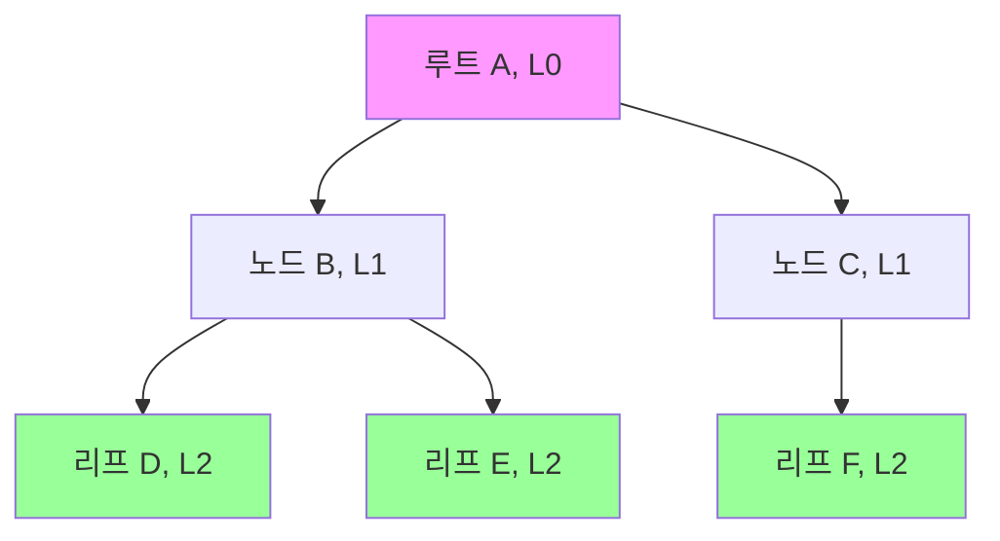

> 자료구조 스터디에서 가장 중요하다고 느꼈던 트리 구조에 대해 정리해 보았습니다. 기본 용어부터 시작해서 순회 방법, 그리고 이진 탐색 트리까지 다룹니다.

<br>

**- 알아볼 내용 -**
1. [트리 기본 개념과 용어](#트리-기본-개념과-용어)
2. [이진 트리와 그 성질](#이진-트리와-그-성질)
3. [트리의 순회 (Traversal)](#트리의-순회-traversal)
4. [이진 탐색 트리 (BST)](#이진-탐색-트리-binary-search-tree-bst)

---

## 트리 기본 개념과 용어

**트리(Tree)**는 이름처럼 나무를 거꾸로 뒤집은 것 같은 계층적 자료구조입니다. 사이클이 없다는 점이 중요하며, 파일 시스템이나 조직도처럼 상하 관계가 명확한 데이터를 표현할 때 아주 유용합니다.

- **노드(Node)**: 트리의 구성 요소. 데이터를 담고 있습니다.
- **간선(Edge)**: 노드와 노드를 잇는 선.
- **루트(Root)**: 트리 최상위에 있는 시작 노드.
- **부모(Parent) / 자식(Child) / 형제(Sibling)**: 노드 간의 가족 관계.
- **리프(Leaf)**: 자식이 없는 맨 끝 노드.
- **서브트리(Subtree)**: 트리 안의 작은 트리.
- **레벨(Level)**: 루트에서 얼마나 떨어져 있는지 나타내는 깊이. (루트는 레벨 0)
- **높이(Height)**: 트리의 최대 레벨.



## 이진 트리와 그 성질

**이진 트리(Binary Tree)**는 모든 노드의 자식이 최대 2개인 트리를 말합니다. 왼쪽 자식과 오른쪽 자식으로 구분됩니다.

#### 이진 트리의 주요 성질
- 노드가 `n`개면, 간선은 항상 `n-1`개입니다.
- 레벨 `k`에는 최대 `2^k`개의 노드가 존재할 수 있습니다.
- 높이가 `h`인 이진 트리의 최대 노드 수는 `2^(h+1) - 1`개입니다.

#### 이진 트리의 종류
- **포화 이진 트리 (Full Binary Tree)**: 모든 노드가 자식을 0개 또는 2개만 갖는 트리.
- **완전 이진 트리 (Complete Binary Tree)**: 마지막 레벨을 제외하고는 완전히 채워져 있고, 마지막 레벨의 노드들은 왼쪽부터 채워진 트리. 힙(Heap)이 대표적인 완전 이진 트리입니다.

## 트리의 순회 (Traversal)

트리의 모든 노드를 한 번씩 방문하는 것을 '순회'라고 합니다. 어떤 순서로 방문하느냐에 따라 여러 방식으로 나뉩니다.

- **전위 순회 (Pre-order)**: **루트 → 왼쪽 → 오른쪽**. 루트를 먼저 방문할 때 사용.
- **중위 순회 (In-order)**: **왼쪽 → 루트 → 오른쪽**. 이진 탐색 트리에서 이 방식으로 순회하면 데이터가 정렬된 순서로 나옵니다.
- **후위 순회 (Post-order)**: **왼쪽 → 오른쪽 → 루트**. 자식 노드를 모두 방문한 후 부모 노드를 방문할 때 사용.
- **레벨 순회 (Level-order)**: 위쪽 레벨부터 차례로, 각 레벨에서는 왼쪽부터 오른쪽으로 방문. 너비 우선 탐색(BFS)과 같습니다.

#### C언어 전체 순회 예제
아래는 하나의 트리 예제를 만들고 모든 방식의 순회를 실행하는 코드입니다. 각 순회의 차이점을 명확하게 비교할 수 있습니다.

```c
#include <stdio.h>
#include <stdlib.h>

// --- 기본 트리 및 큐 설정 ---
typedef struct TreeNode {
    int data;
    struct TreeNode *left;
    struct TreeNode *right;
} TreeNode;

#define MAX_QUEUE_SIZE 100
TreeNode* queue[MAX_QUEUE_SIZE];
int front = -1, rear = -1;

void enqueue(TreeNode* ptr) { if (rear < MAX_QUEUE_SIZE - 1) queue[++rear] = ptr; }
TreeNode* dequeue() { return (front == rear) ? NULL : queue[++front]; }
int is_queue_empty() { return front == rear; }

// --- 순회 함수들 ---
void preorder(TreeNode *root) {
    if (root != NULL) {
        printf("%d ", root->data);
        preorder(root->left);
        preorder(root->right);
    }
}

void inorder(TreeNode *root) {
    if (root != NULL) {
        inorder(root->left);
        printf("%d ", root->data);
        inorder(root->right);
    }
}

void postorder(TreeNode *root) {
    if (root != NULL) {
        postorder(root->left);
        postorder(root->right);
        printf("%d ", root->data);
    }
}

void levelorder(TreeNode *root) {
    if (root == NULL) return;
    enqueue(root);
    while (!is_queue_empty()) {
        TreeNode *current = dequeue();
        printf("%d ", current->data);
        if (current->left) enqueue(current->left);
        if (current->right) enqueue(current->right);
    }
}

// --- 메인 함수 ---
int main(void) {
    // 예제 트리 생성:
    //      1
    //     / \
    //    2   3
    //   / \
    //  4   5
    TreeNode n1={1, NULL, NULL}, n2={2, NULL, NULL}, n3={3, NULL, NULL}, n4={4, NULL, NULL}, n5={5, NULL, NULL};
    TreeNode *root = &n1;
    n1.left = &n2; n1.right = &n3;
    n2.left = &n4; n2.right = &n5;

    printf("전위 순회: "); preorder(root); printf("\n");
    printf("중위 순회: "); inorder(root); printf("\n");
    printf("후위 순회: "); postorder(root); printf("\n");
    printf("레벨 순회: "); levelorder(root); printf("\n");

    return 0;
}
// 전위 순회: 1 2 4 5 3
// 중위 순회: 4 2 5 1 3
// 후위 순회: 4 5 2 3 1
// 레벨 순회: 1 2 3 4 5
```

## 이진 탐색 트리 (Binary Search Tree, BST)
탐색에 특화된 이진 트리로, 다음과 같은 규칙을 가집니다.
1. 왼쪽 서브트리는 현재 노드의 값보다 작은 값들만 가집니다.
2. 오른쪽 서브트리는 현재 노드의 값보다 큰 값들만 가집니다.
3. 모든 서브트리 역시 이진 탐색 트리입니다.

이 규칙 덕분에 평균적으로 **O(log n)**의 빠른 시간 복잡도로 데이터를 탐색, 삽입, 삭제할 수 있습니다. (단, 트리가 한쪽으로 치우쳐진 최악의 경우 O(n)이 될 수 있습니다.)

#### 탐색, 삽입 연산
- **탐색**: 찾으려는 값이 현재 노드보다 작으면 왼쪽, 크면 오른쪽으로 이동하는 과정을 반복합니다.
- **삽입**: 탐색과 똑같이 진행하다가, 노드가 들어갈 `NULL` 위치를 찾으면 새 노드를 연결합니다.

#### 삭제 연산
삭제는 조금 더 복잡한데, 삭제하려는 노드의 자식 수에 따라 경우가 나뉩니다.

```c
// 오른쪽 서브트리에서 가장 작은 값을 찾는 헬퍼 함수
TreeNode* min_value_node(TreeNode* node) {
    TreeNode* current = node;
    while (current && current->left != NULL) {
        current = current->left;
    }
    return current;
}

// 이진 탐색 트리 삭제 함수 (주석 보강)
TreeNode* delete_node(TreeNode *root, int key) {
    if (root == NULL) return root; // 기저 사례

    // 삭제할 노드를 찾아 내려감
    if (key < root->data) {
        root->left = delete_node(root->left, key);
    } else if (key > root->data) {
        root->right = delete_node(root->right, key);
    } 
    // 삭제할 노드를 찾았을 때
    else {
        // Case 1: 자식이 없거나, 오른쪽 자식만 있는 경우
        if (root->left == NULL) {
            TreeNode *temp = root->right;
            free(root);
            return temp; // 오른쪽 자식을 부모에게 연결
        }
        // Case 2: 왼쪽 자식만 있는 경우
        else if (root->right == NULL) {
            TreeNode *temp = root->left;
            free(root);
            return temp; // 왼쪽 자식을 부모에게 연결
        }

        // Case 3: 자식이 둘 다 있는 경우
        // -> 오른쪽 서브트리에서 가장 작은 노드(후계자)를 찾는다.
        TreeNode* temp = min_value_node(root->right);

        // -> 현재 노드의 데이터를 후계자 데이터로 교체한다.
        root->data = temp->data;

        // -> 원래 위치에 있던 후계자 노드를 재귀적으로 삭제한다.
        root->right = delete_node(root->right, temp->data);
    }
    return root;
}
```
이것으로 트리 구조에 대한 기본적인 내용과 구현 방법을 정리해 보았습니다. 특히 순회는 트리를 다루는 모든 알고리즘의 기초가 되니, 각 방식의 차이점을 잘 이해하는 것이 중요한 것 같습니다.
