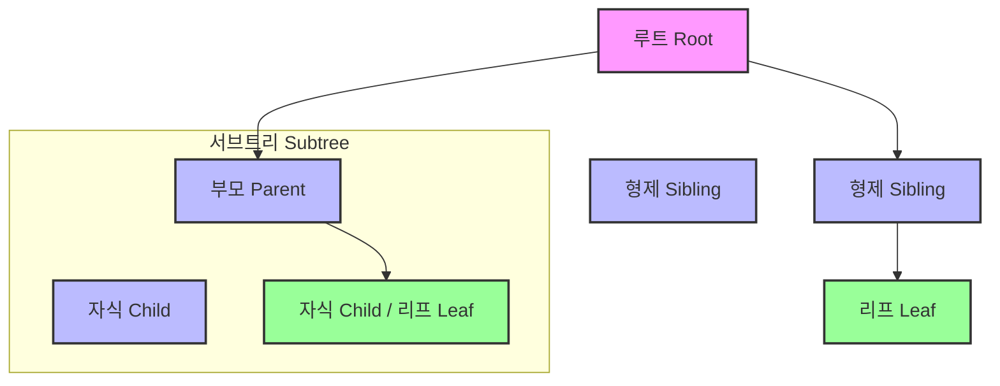
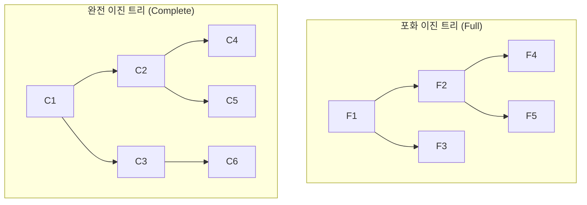
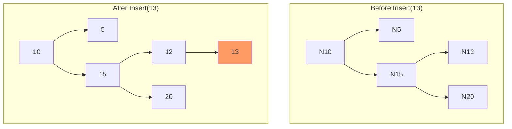

## 트리란 무엇인가?

트리(Tree)는 이름처럼 나무를 거꾸로 뒤집어 놓은 것 같은 계층적 구조를 표현하는 비선형(non-linear) 자료구조입니다. 파일 시스템, 조직도, 데이터베이스 인덱싱 등 계층적인 데이터를 표현하고 관리하는 데 매우 유용합니다.

트리는 **하나 이상의 노드(Node)**로 구성되며, 최상위 노드인 **루트(Root)**를 가집니다. 각 노드는 0개 이상의 자식 노드를 가질 수 있으며, 부모-자식 관계는 **간선(Edge)**으로 연결됩니다. 트리의 중요한 특징 중 하나는 **사이클(Cycle)이 없다**는 것입니다.

## 주요 용어 정리

트리 구조를 이해하기 위해 몇 가지 핵심 용어를 알아봅시다.



- **노드 (Node)**: 트리의 구성 요소 (A, B, C, D, E, F, G)
- **간선 (Edge)**: 노드와 노드를 연결하는 선
- **루트 노드 (Root Node)**: 트리 구조의 시작점이 되는 최상위 노드 (A)
- **부모 노드 (Parent Node)**: 특정 노드의 상위 노드 (A는 B, C, D의 부모)
- **자식 노드 (Child Node)**: 특정 노드의 하위 노드 (B, C, D는 A의 자식)
- **리프 노드 (Leaf Node)**: 자식 노드가 없는 맨 마지막 노드 (F, G, E)
- **형제 노드 (Sibling Node)**: 같은 부모를 가지는 노드 (B, C, D)
- **서브트리 (Subtree)**: 트리의 일부 노드들로 구성된 작은 트리 (B, E, F로 구성된 부분)
- **레벨 (Level)**: 루트로부터 얼마나 떨어져 있는지 나타내는 깊이. 루트는 보통 레벨 0 또는 1입니다.
- **높이 (Height)**: 트리가 가지는 최대 레벨.

## 이진 트리 (Binary Tree)

**이진 트리**는 각 노드가 최대 두 개의 자식 노드를 가질 수 있는 트리를 말합니다. 자식 노드는 각각 **왼쪽 자식(left child)**과 **오른쪽 자식(right child)**으로 구분됩니다.

### 이진 트리의 주요 성질 (Key Properties of Binary Trees)

이진 트리는 몇 가지 중요한 수학적 성질을 가집니다. (루트 레벨을 0으로 가정)

- **노드와 간선의 관계**: `n`개의 노드를 가진 이진 트리는 항상 `n-1`개의 간선을 가집니다.
- **레벨별 최대 노드 수**: 레벨 `k`에 존재할 수 있는 최대 노드의 수는 `2^k`개 입니다.
- **높이와 노드의 관계**: 높이가 `h`인 이진 트리가 가질 수 있는 최대 노드의 수는 `2^(h+1) - 1`개 입니다. (모든 노드가 꽉 찬 포화 이진 트리의 경우)

### 이진 트리의 종류

- **포화 이진 트리 (Full Binary Tree)**: 모든 노드가 0개 또는 2개의 자식 노드를 가지는 트리입니다.
- **완전 이진 트리 (Complete Binary Tree)**: 마지막 레벨을 제외하고 모든 레벨이 완전히 채워져 있으며, 마지막 레벨의 노드들은 왼쪽부터 차례로 채워져 있는 트리입니다.



## 트리의 순회 (Traversal)

트리의 모든 노드를 한 번씩 방문하는 것을 순회라고 합니다. 순회 방법에는 깊이 우선 탐색(DFS)과 너비 우선 탐색(BFS) 기반의 여러 방식이 있습니다.

### C언어 기본 노드 구조

순회 코드를 작성하기 전에 기본이 될 이진 트리 노드 구조체를 정의합니다.

```c
#include <stdio.h>
#include <stdlib.h>

typedef struct TreeNode {
    int data;
    struct TreeNode *left;
    struct TreeNode *right;
} TreeNode;
```

### 깊이 우선 탐색 (DFS) 기반 순회

#### 1. 전위 순회 (Pre-order Traversal)

**루트 → 왼쪽 서브트리 → 오른쪽 서브트리** 순서로 노드를 방문합니다.

- **C 코드**
```c
void preorder(TreeNode *root) {
    if (root != NULL) {
        printf("[%d] ", root->data);  // 1. 루트 방문
        preorder(root->left);         // 2. 왼쪽 서브트리 순회
        preorder(root->right);        // 3. 오른쪽 서브트리 순회
    }
}
```

#### 2. 중위 순회 (In-order Traversal)

**왼쪽 서브트리 → 루트 → 오른쪽 서브트리** 순서로 노드를 방문합니다. 이진 탐색 트리에서 중위 순회를 하면 정렬된 결과를 얻을 수 있습니다.

- **C 코드**
```c
void inorder(TreeNode *root) {
    if (root != NULL) {
        inorder(root->left);          // 1. 왼쪽 서브트리 순회
        printf("[%d] ", root->data);  // 2. 루트 방문
        inorder(root->right);         // 3. 오른쪽 서브트리 순회
    }
}
```

#### 3. 후위 순회 (Post-order Traversal)

**왼쪽 서브트리 → 오른쪽 서브트리 → 루트** 순서로 노드를 방문합니다.

- **C 코드**
```c
void postorder(TreeNode *root) {
    if (root != NULL) {
        postorder(root->left);        // 1. 왼쪽 서브트리 순회
        postorder(root->right);       // 2. 오른쪽 서브트리 순회
        printf("[%d] ", root->data);  // 3. 루트 방문
    }
}
```

### 너비 우선 탐색 (BFS) 기반 순회

#### 레벨 순회 (Level-order Traversal)

루트 노드부터 시작하여 각 레벨별로 왼쪽에서 오른쪽 순서로 노드를 방문합니다. 큐(Queue)를 사용하여 구현합니다.

- **C 코드 (큐 포함)**
```c
// 간단한 큐 구현
#define MAX_QUEUE_SIZE 100
TreeNode* queue[MAX_QUEUE_SIZE];
int front = -1, rear = -1;

void enqueue(TreeNode* ptr) {
    if (rear < MAX_QUEUE_SIZE - 1) {
        queue[++rear] = ptr;
    }
}

TreeNode* dequeue() {
    if (front != rear) {
        return queue[++front];
    }
    return NULL;
}

int is_queue_empty() {
    return front == rear;
}

// 레벨 순회 함수
void levelorder(TreeNode *root) {
    if (root == NULL) return;

    enqueue(root); // 큐에 루트 노드 추가
    while (!is_queue_empty()) {
        TreeNode *current = dequeue();
        if (current) {
            printf("[%d] ", current->data);
            if (current->left) {
                enqueue(current->left);
            }
            if (current->right) {
                enqueue(current->right);
            }
        }
    }
}
```

## 이진 탐색 트리 (Binary Search Tree, BST)

**이진 탐색 트리**는 이진 트리에 다음과 같은 특정 규칙이 추가된 트리입니다.

1.  모든 노드의 왼쪽 서브트리에는 해당 노드의 값보다 작은 값들만 존재합니다.
2.  모든 노드의 오른쪽 서브트리에는 해당 노드의 값보다 큰 값들만 존재합니다.
3.  모든 서브트리 또한 이진 탐색 트리입니다.
4.  중복된 값을 허용하지 않습니다.

이 구조 덕분에 데이터를 효율적으로 탐색, 삽입, 삭제할 수 있습니다. 평균 시간 복잡도는 **O(log n)**이지만, 트리가 한쪽으로 치우쳐진 편향 트리(skewed tree)가 될 경우 최악의 시간 복잡도는 **O(n)**이 될 수 있습니다.

### 탐색 (Search) 연산

루트부터 시작하여 찾고자 하는 값을 비교합니다.
- 찾는 값이 현재 노드보다 작으면 왼쪽으로 이동합니다.
- 찾는 값이 현재 노드보다 크면 오른쪽으로 이동합니다.
- 같으면 탐색 성공입니다.

```c
TreeNode* search(TreeNode *root, int key) {
    if (root == NULL || root->data == key) {
        return root;
    }

    if (key < root->data) {
        return search(root->left, key);
    } else {
        return search(root->right, key);
    }
}
```

### 삽입 (Insertion) 연산

탐색과 유사하게 진행하다가, 트리의 끝(NULL)에 도달하면 그 위치에 새로운 노드를 삽입합니다.



```c
TreeNode* insert_node(TreeNode *root, int key) {
    if (root == NULL) {
        TreeNode* newNode = (TreeNode*)malloc(sizeof(TreeNode));
        newNode->data = key;
        newNode->left = newNode->right = NULL;
        return newNode;
    }

    if (key < root->data) {
        root->left = insert_node(root->left, key);
    } else if (key > root->data) {
        root->right = insert_node(root->right, key);
    }
    
    return root; // 중복된 값은 무시
}
```

### 삭제 (Deletion) 연산

삭제는 세 가지 경우를 고려해야 해서 조금 더 복잡합니다.

1.  **자식이 없는 리프 노드를 삭제할 경우**: 그냥 삭제합니다.
2.  **자식이 하나인 노드를 삭제할 경우**: 해당 노드를 삭제하고 그 자리에 자식 노드를 연결합니다.
3.  **자식이 둘인 노드를 삭제할 경우**:
    - 오른쪽 서브트리에서 가장 작은 값(successor) 또는 왼쪽 서브트리에서 가장 큰 값(predecessor)을 찾아 현재 노드와 교체합니다.
    - 그 후, 원래 위치에 있던 successor/predecessor 노드를 재귀적으로 삭제합니다.

```c
// 오른쪽 서브트리에서 가장 작은 값을 찾는 함수
TreeNode* min_value_node(TreeNode* node) {
    TreeNode* current = node;
    while (current && current->left != NULL) {
        current = current->left;
    }
    return current;
}

TreeNode* delete_node(TreeNode *root, int key) {
    if (root == NULL) return root;

    if (key < root->data) {
        root->left = delete_node(root->left, key);
    } else if (key > root->data) {
        root->right = delete_node(root->right, key);
    } else { // 삭제할 노드를 찾은 경우
        // Case 1 & 2: 자식이 없거나 하나인 경우
        if (root->left == NULL) {
            TreeNode *temp = root->right;
            free(root);
            return temp;
        } else if (root->right == NULL) {
            TreeNode *temp = root->left;
            free(root);
            return temp;
        }

        // Case 3: 자식이 둘인 경우
        TreeNode* temp = min_value_node(root->right); // 오른쪽 서브트리에서 가장 작은 노드 찾기
        root->data = temp->data; // 현재 노드를 후계자 노드의 값으로 교체
        root->right = delete_node(root->right, temp->data); // 후계자 노드 삭제
    }
    return root;
}
```
