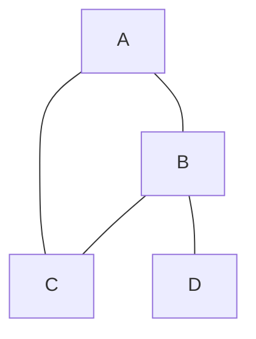

## 그래프(Graph)란 무엇일까?

컴퓨터 과학에서 **그래프(Graph)**는 여러 개의 **정점(Vertex)**들이 서로 복잡하게 연결된 관계를 표현하는 자료구조입니다. 정점들은 **간선(Edge)**을 통해 연결되며, 도로망, 소셜 네트워크, 웹 페이지 링크 등 우리 주변의 다양한 관계를 모델링하는 데 사용됩니다.

트리(Tree)와 달리 그래프는 부모-자식 관계가 없고, 여러 개의 경로가 존재할 수 있으며, **사이클(Cycle)**이 형성될 수도 있습니다.

## 그래프의 핵심 용어 정리

- **정점 (Vertex)**: 데이터를 나타내는 점 또는 노드.
- **간선 (Edge)**: 두 정점을 연결하는 선.
- **인접 정점 (Adjacent Vertex)**: 하나의 간선으로 직접 연결된 두 정점.
- **차수 (Degree)**: 한 정점에 연결된 간선의 수.
  - **진입 차수 (In-degree)**: 방향 그래프에서 한 정점으로 들어오는 간선의 수.
  - **진출 차수 (Out-degree)**: 방향 그래프에서 한 정점에서 나가는 간선의 수.
- **경로 (Path)**: 정점들을 순서대로 나열한 것으로, 각 정점은 간선으로 연결되어 있어야 합니다.
- **사이클 (Cycle)**: 시작 정점과 끝 정점이 같은 단순 경로(중복 정점 없음).

## 그래프의 종류

1.  **무방향 그래프 (Undirected Graph)**
    - 간선에 방향이 없는 그래프. 두 정점은 양방향으로 오갈 수 있습니다.
    ```mermaid
    graph TD
        A --- B
        A --- C
        B --- D
        C --- D
    ```

2.  **방향 그래프 (Directed Graph)**
    - 간선에 방향이 있는 그래프. 화살표 방향으로만 이동할 수 있습니다.
    ```mermaid
    graph TD
        A --> B
        C --> A
        B --> D
        D --> C
    ```

3.  **가중치 그래프 (Weighted Graph)**
    - 간선에 비용이나 거리 같은 가중치(Weight)가 부여된 그래프. '네트워크(Network)'라고도 불립니다.

## 그래프의 표현 방법

그래프를 코드로 표현하는 데는 주로 두 가지 방법이 사용됩니다.

### 1. 인접 행렬 (Adjacency Matrix)

정점의 개수가 N일 때, N x N 크기의 2차원 배열을 사용하여 정점 간의 연결 관계를 표현합니다. `matrix[i][j]`는 정점 i에서 j로 가는 간선이 있으면 1(또는 가중치), 없으면 0으로 표시합니다.

- **장점**: 두 정점의 연결 여부를 **O(1)** 시간에 바로 알 수 있습니다.
- **단점**: 간선 수와 무관하게 항상 **O(N²)**의 공간을 차지하여, 간선이 적은 '희소 그래프'의 경우 비효율적입니다.

**예시:**

**인접 행렬:**
| | A | B | C | D |
|---|:---:|:---:|:---:|:---:|
|**A**| 0 | 1 | 1 | 0 |
|**B**| 1 | 0 | 1 | 1 |
|**C**| 1 | 1 | 0 | 0 |
|**D**| 0 | 1 | 0 | 0 |

### 2. 인접 리스트 (Adjacency List)

각 정점에 연결된 정점들의 리스트를 저장하는 방식입니다.

- **장점**: 간선의 개수만큼만 공간을 차지하여(O(N+E), E는 간선 수) 공간 효율성이 좋습니다.
- **단점**: 두 정점의 연결 여부를 확인하려면 해당 정점의 리스트를 모두 탐색해야 하므로 최악의 경우 **O(N)**의 시간이 걸릴 수 있습니다.

**예시:**
- A: [B, C]
- B: [A, C, D]
- C: [A, B]
- D: [B]

## 그래프 탐색 알고리즘

그래프의 모든 정점을 한 번씩 방문하는 것을 **그래프 탐색**이라고 합니다. 대표적인 두 가지 방법이 있습니다.

### 1. 깊이 우선 탐색 (DFS, Depth-First Search)

**깊이 우선 탐색(DFS)**은 최대한 깊이 들어갈 수 있을 때까지 들어간 후, 더 이상 갈 곳이 없으면 이전 정점으로 돌아와 다른 경로를 탐색하는 방법입니다. **스택(Stack)** 또는 **재귀 함수**를 사용하여 구현합니다.

**동작 방식:**
1. 시작 정점을 방문하고 스택에 넣습니다.
2. 스택의 최상단 노드에 방문하지 않은 인접 노드가 있으면, 그 노드를 방문하고 스택에 추가합니다.
3. 방문할 인접 노드가 없으면 스택에서 노드를 꺼냅니다(pop).
4. 스택이 빌 때까지 2-3번 과정을 반복합니다.

### 2. 너비 우선 탐색 (BFS, Breadth-First Search)

**너비 우선 탐색(BFS)**은 시작 정점에서 가까운 정점부터 순서대로 탐색하는 방법입니다. **큐(Queue)**를 사용하여 구현하며, 가중치가 없는 그래프에서 최단 경로를 찾는 데 사용될 수 있습니다.

**동작 방식:**
1. 시작 정점을 방문하고 큐에 넣습니다.
2. 큐에서 노드를 하나 꺼내(dequeue) 방문합니다.
3. 꺼낸 노드의 모든 미방문 인접 노드를 큐에 추가합니다.
4. 큐가 빌 때까지 2-3번 과정을 반복합니다.

**탐색 순서 예시:**
```mermaid
graph TD
    subgraph 탐색할 그래프
        A --- B; A --- C; A --- D;
        B --- E; B --- F;
        C --- G;
        D --- H;
    end
    subgraph DFS (깊이 우선)
        direction LR
        A_dfs[A] --> B_dfs[B] --> E_dfs[E] --> F_dfs[F] --> C_dfs[C] --> G_dfs[G] --> D_dfs[D] --> H_dfs[H]
    end
    subgraph BFS (너비 우선)
        direction LR
        A_bfs[A] --> B_bfs[B] --> C_bfs[C] --> D_bfs[D] --> E_bfs[E] --> F_bfs[F] --> G_bfs[G] --> H_bfs[H]
    end
```
*DFS는 스택 구현에 따라 방문 순서가 달라질 수 있습니다.*
