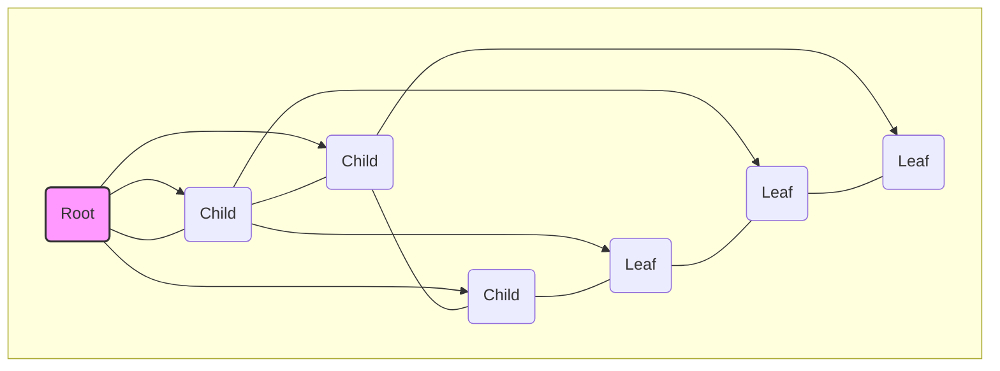

## 트리(Tree)란 무엇일까?

컴퓨터 과학에서 **트리(Tree)**는 이름 그대로 나무를 거꾸로 뒤집어 놓은 듯한 형태의 **계층적 자료구조**입니다. 하나의 아이템이 여러 개의 다른 아이템을 가리키고, 이 관계가 연쇄적으로 이어지지만 **사이클(Cycle)이 없는** 것이 특징입니다. 가계도나 회사의 조직도, 컴퓨터의 파일 시스템처럼 계층적인 데이터를 표현하는 데 매우 유용합니다.

## 트리의 핵심 용어 정리

트리를 이해하려면 몇 가지 기본적인 용어를 알아야 합니다.



- **노드(Node)**: 트리를 구성하는 기본 요소. 데이터와 다른 노드를 가리키는 링크를 포함합니다. 위 그림의 모든 동그라미가 노드입니다.
- **루트(Root)**: 트리의 가장 높은 곳에 있는 시작 노드. 부모가 없는 유일한 노드입니다. (A)
- **부모(Parent) & 자식(Child)**: 어떤 노드에서 다른 노드로 연결될 때, 연결하는 쪽이 부모, 연결되는 쪽이 자식입니다. (A는 B,C,D의 부모)
- **간선(Edge)**: 노드와 노드를 연결하는 선.
- **리프(Leaf) 노드**: 자식이 없는 노드. 트리의 가장 끝에 위치합니다. (E, F, G)
- **내부(Internal) 노드**: 리프 노드가 아닌 노드. 즉, 자식을 하나 이상 가진 노드입니다. (A, B, C, D)
- **깊이(Depth)**: 루트 노드에서 특정 노드까지 가는 데 거치는 간선의 수. 루트의 깊이는 0입니다.
- **높이(Height)**: 트리의 가장 깊은 리프 노드의 깊이. 즉, 트리의 최대 깊이입니다.
- **서브트리(Subtree)**: 트리의 한 노드와 그 노드의 모든 자손들로 이루어진 또 다른 트리.

## 이진 트리 (Binary Tree)

**이진 트리**는 모든 노드가 **최대 2개**의 자식 노드를 가질 수 있는 트리를 말합니다. 각 노드는 `left`와 `right`라는 두 개의 자식 포인터를 가집니다.

### 이진 트리의 종류

1.  **포화 이진 트리 (Full Binary Tree)**
    - 모든 노드가 0개 또는 2개의 자식 노드를 가지며, 모든 리프 노드가 동일한 깊이에 있는 트리입니다.
    ```mermaid
    graph TD
        A --> B;
        A --> C;
        B --> D;
        B --> E;
        C --> F;
        C --> G;
    ```

2.  **완전 이진 트리 (Complete Binary Tree)**
    - 마지막 레벨을 제외한 모든 레벨이 완전히 채워져 있고, 마지막 레벨의 노드들은 왼쪽부터 차례대로 채워져 있는 트리입니다. 포화 이진 트리는 항상 완전 이진 트리입니다.
    ```mermaid
    graph TD
        A --> B;
        A --> C;
        B --> D;
        B --> E;
        C --> F;
    ```

## 트리의 순회 (Traversal)

트리의 모든 노드를 한 번씩 방문하는 것을 **순회**라고 합니다. 이진 트리에서는 주로 다음 4가지 방법이 사용됩니다.

- **전위 순회 (Pre-order)**: **루트 → 왼쪽 → 오른쪽** 순서로 방문 (`VLR`)
- **중위 순회 (In-order)**: **왼쪽 → 루트 → 오른쪽** 순서로 방문 (`LVR`)
- **후위 순회 (Post-order)**: **왼쪽 → 오른쪽 → 루트** 순서로 방문 (`LRV`)
- **레벨 순회 (Level-order)**: 루트부터 시작하여 각 레벨별로 왼쪽에서 오른쪽으로 차례대로 방문 (BFS와 동일)

```mermaid
graph TD
    F --> B;
    F --> G;
    B --> A;
    B --> D;
    D --> C;
    D --> E;
    G --> I;
    I --> H;

    subgraph "방문 순서 예시"
        direction LR
        subgraph 전위 순회 (VLR)
            direction LR
            F_pre[F] --> B_pre[B] --> A_pre[A] --> D_pre[D] --> C_pre[C] --> E_pre[E] --> G_pre[G] --> I_pre[I] --> H_pre[H]
        end
        subgraph 중위 순회 (LVR)
            direction LR
            A_in[A] --> B_in[B] --> C_in[C] --> D_in[D] --> E_in[E] --> F_in[F] --> G_in[G] --> H_in[H] --> I_in[I]
        end
        subgraph 후위 순회 (LRV)
            direction LR
            A_post[A] --> C_post[C] --> E_post[E] --> D_post[D] --> B_post[B] --> H_post[H] --> I_post[I] --> G_post[G] --> F_post[F]
        end
    end
```

## 이진 탐색 트리 (Binary Search Tree, BST)

**이진 탐색 트리(BST)**는 이진 트리에 다음과 같은 탐색을 위한 제약 조건이 추가된 자료구조입니다.

- 모든 노드의 키(key)는 유일합니다.
- 특정 노드의 **왼쪽 서브트리**에 있는 모든 노드의 키는 해당 노드의 키보다 **작습니다**.
- 특정 노드의 **오른쪽 서브트리**에 있는 모든 노드의 키는 해당 노드의 키보다 **큽니다**.
- 왼쪽과 오른쪽 서브트리 또한 각각 이진 탐색 트리입니다.

이러한 특징 덕분에 중위 순회(In-order)를 하면 노드들이 키 값 순서대로 정렬되어 출력됩니다.

### 이진 탐색 트리의 연산

1.  **탐색 (Search)**
    - 루트에서 시작하여 찾으려는 값과 현재 노드의 값을 비교합니다.
    - 찾는 값이 더 작으면 왼쪽 자식으로, 더 크면 오른쪽 자식으로 이동합니다.
    - 이 과정을 일치하는 값을 찾거나 리프 노드에 도달할 때까지 반복합니다. 평균 시간 복잡도는 **O(log n)**입니다.

2.  **삽입 (Insertion)**
    - 탐색 연산과 동일한 방식으로 새 노드가 들어갈 위치를 찾습니다.
    - 탐색이 실패하는 지점(null 포인터)에 새 노드를 삽입합니다.

3.  **삭제 (Deletion)**
    - 가장 복잡한 연산으로, 경우에 따라 다르게 처리해야 합니다.
      1.  **리프 노드 삭제**: 그냥 삭제합니다.
      2.  **자식이 하나인 노드 삭제**: 해당 노드를 삭제하고 그 자리에 자식 노드를 연결합니다.
      3.  **자식이 둘인 노드 삭제**: 삭제할 노드의 **오른쪽 서브트리에서 가장 작은 값** (In-order Successor) 또는 **왼쪽 서브트리에서 가장 큰 값** (In-order Predecessor)을 찾아 그 위치를 대체한 후, 원래 위치에 있던 대체 노드를 삭제합니다.

이진 탐색 트리는 평균적으로 매우 효율적인 탐색 성능을 보이지만, 데이터가 정렬된 순서로 들어올 경우 한쪽으로 치우쳐진 **편향 트리(Skewed Tree)**가 되어 성능이 **O(n)**으로 저하될 수 있습니다. 이를 해결하기 위해 `AVL 트리`, `Red-Black 트리`와 같은 **자가 균형 이진 탐색 트리(Self-Balancing BST)**가 사용되기도 합니다.
